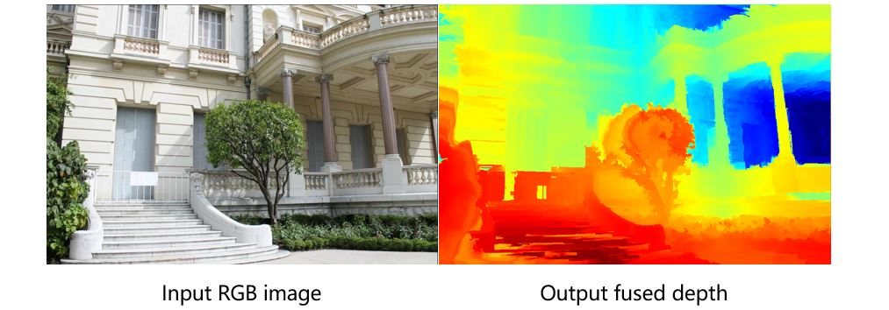

# MSTdepth: Image-Based Rendering for Large-Scale Outdoor Scenes With Fusion of Monocular and Multi-View Stereo Depth

This code is part of our work "[Image-Based Rendering for Large-Scale Outdoor Scenes With Fusion of Monocular and Multi-View Stereo Depth](https://ieeexplore.ieee.org/document/9123380)." 

We provided here an implementation of the core MST-based depth fusion algorithm.

## Requirements

-  [OpenCV 3.4.x](http://www.opencv.org/)
-  Eigen3
-  C++ (support c++11)
-  CMake

## Run the Example

```
$ unzip data.zip
$ mkdir build
$ cd build
$ cmake ..
$ make
$ ./MSTdepth ../data/museum1.jpg.geometric.bin ../data/museum1.jpg.mono.png ../data/museum1.jpg
```

**Result:**

<p align="center">
  </p>
  
**Run your images:**

The MVS depth map (museum1.jpg.geometric.bin) can be obtained by [COLMAP](https://colmap.github.io/index.html).

The Monocular depth map (museum1.jpg.mono.png, 16bit) can be obtained by [MegaDepth](https://github.com/zhengqili/MegaDepth).

You can also use other methods to generate MVS depth and monocular depth but may need to rewrite some functions to read your depth map file.


## Citation

If you find this code useful in your research or fun project, please consider citing the paper:

```
@ARTICLE{liu20ibr,  
author={S. {Liu} and M. {Li} and X. {Zhang} and S. {Liu} and Z. {Li} and J. {Liu} and T. {Mao}},  
journal={IEEE Access},   
title={Image-Based Rendering for Large-Scale Outdoor Scenes With Fusion of Monocular and Multi-View Stereo Depth},   
year={2020},  
volume={8},  
number={},  
pages={117551-117565},}
```

